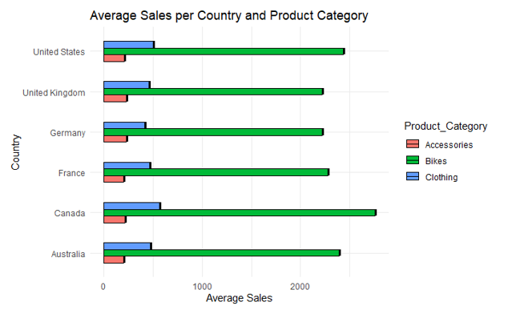
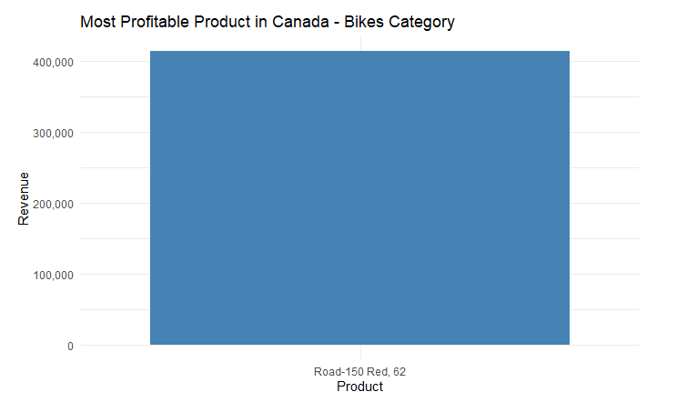

# Global_Bike_Sales

Data-Driven Strategic Recommendations and Business Report

CONTENT

Executive Summary

Introduction: Data set Overview and Visualization Information

Key Insights

Strategic Recommendation

Conclusion

Appendix

EXECUTIVE SUMMARY

Purpose

This report offers a summary of bike sales transactions across different product categories. Its goal is to identify trends and opportunities for improvement by analyzing sales data. Additionally, it provides recommendations to management on how to increase sales and profitability.

Recommendation

Cross-Promote Bikes with Clothing and Accessories

Targeted Marketing Campaigns

Product Differentiation

Market Research and Customer Insights

Introduction: Dataset Overview and manipulation 

Dataset Name: Global_Sales.csv

The dataset provides information on bike sales transactions over 6 years, including purchases of accessories and clothing items in different countries like Australia, Canada, and France. The data includes details on the number of items sold, their cost, and the total revenue generated during this period.

Data Visualization Information

Use of clustered column chart to compare the average sales, by business location per product category.
The use of bar chart to show the most profitable product in Canada based on revenue.

Average Sales Per Country and Product Category

The analysis reveals that the product category "Bikes" has the highest contribution to the total revenue across all six locations
On the other hand, the graph suggests that "Clothing and Accessories" could be the least profitable.

Most Profitable Product in Canada - Bikes Category

The product (Road 150 Red 62) contributed to the highest quantity sold and revenue made across all bike transactions sales.

Strategic Recommendation

After analyzing the revenue generated by different product categories, it has been found that bikes are the highest contributors while clothing and accessories bring in the least profit. To improve sales across all six locations, the following are strategic recommendations for the business.

1. Cross-Promote Bikes with Clothing and Accessories

Implement cross-promotion strategies by showcasing how clothing and accessories enhance the biking experience. This should be first implemented with staffs across locations before customers.
Offer special promotions or discounts for customers who purchase a bike along with related clothing and accessories, encouraging them to make complementary purchases. For example,  “BOGO” offers of promotion

2. Targeted Marketing Campaigns

Develop targeted marketing campaigns to raise awareness and generate interest in the clothing and accessories category. For example, targeting certain demographics(Age and Sex) or location.
Highlight the benefits and unique features of the clothing and accessories across all locations to attract potential customers and increase sales. For example, through various marketing channels such as social media and online advertisement(Sport section).

3. Product Differentiation

Examine the important characteristics and qualities of the Road 150 Red 62 that make it a favored option among consumers. Determine its distinct advantages and include them in the design of future or existing bike models.
To broaden its customer base and boost sales, the business can offer a variety of bikes with unique features and specifications across different models based on customers unmet needs..

4. Market Research and Customer Insights

To better understand what customer’s want in accessories and clothing, it's important to conduct market research to identify preferences, trends, and demands.
The objective of this survey and analysis is to pinpoint any deficiencies and potential possibilities in the accessories and clothing product category. The aim is to cater to customers' requirements and preferences, leading to an increase in sales.

Conclusion

To boost sales for clothing and accessories, it would be advantageous to incorporate cross-promotion strategies with bikes and relevant products, accompanied by targeted marketing campaigns. By offering enticing deals, such as "BOGO", customers can be encouraged to purchase complementary items, ultimately leading to a rise in revenue.
 Furthermore, conducting market research to gain a better understanding of customer preferences and distinguishing bike models can help the business cater to specific needs and increase sales in the long run. 

Following these recommendations can help the business enhance its product offerings and ensure revenue growth across all six locations.

Thank you for reading through.

Please feel free to give recommendation on how i could improve my Analysis.

